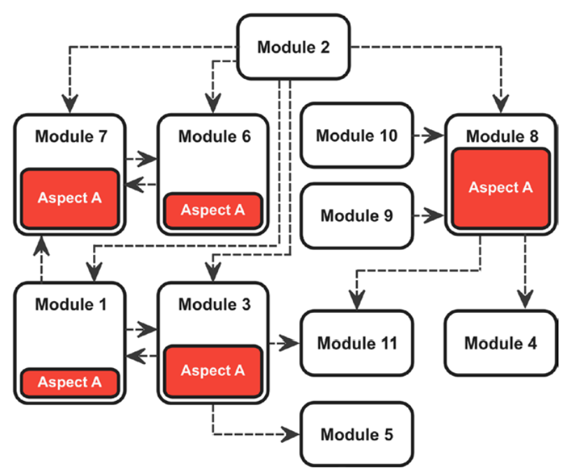
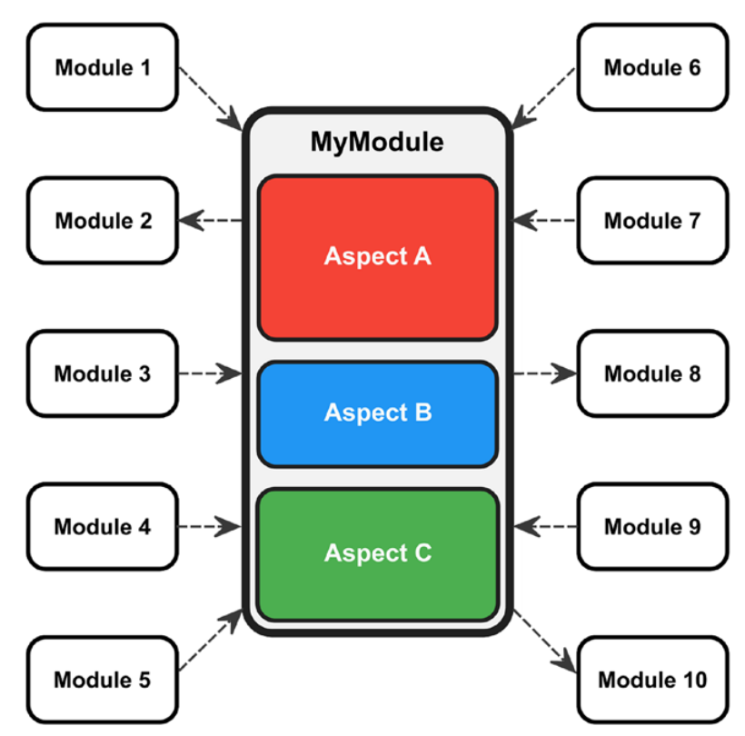
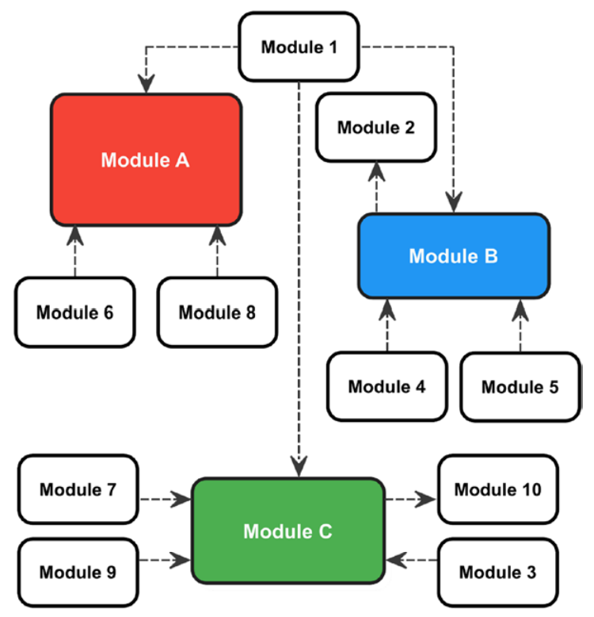

# 程序设计原则-Be Principled

Roth在第三章介绍了一些可以帮助开发者写出更好的代码/设计更优良的软件的原则。

## KISS

> Focusing on simplicity is probably one of the most difficult things to do for a programmer.  And it is a life long learning experience.

“Keep it simple and stupid”——不要让编程变得复杂。这个原则常常被软件开发人员所遗忘，他们倾向于精心设计他们的代码，并因此引入了很多本没有必要的复杂性。

任何软件系统都有其内在的复杂性，复杂的问题往往需要复杂的代码。由于系统要满足的要求，这种本质上的复杂性就在那里，不能被降低。但是，如果在这种内在的复杂性上增加不必要的、自制的复杂性，那将是致命的。

因此，在使用简单而直接的代码就能实现对应功能的情况下，没有必要使用花哨的函数或炫酷的设计模式。考虑对自己来说哪种目的更为重要，然后把重点放在那个目的上，随后再考虑是否需要额外的复杂性。

>"如果把所有的敌人和子弹都放在四叉树里，我的《太空侵略者》就会有更好的性能，所以我最好开始创建一个四叉树......"
>
>如果想要学习四叉树，这是不错的思考方法；然而如果想要制作软件，这种思考方式会增加编程的复杂性，使你难以今早完成可以顺利工作的软件，而且可能带来更多意想不到的bug。

另一方面，不要过分强调简单性。如果你发现一个switch语句里的五十个case都是必要的，那就不要再尝试去简化它。

当然，如果有高优先级的质量要求，如灵活性和可扩展性，你就必须增加复杂性来满足这些要求。但要小心，只增加能使事情变得更容易的复杂性。

## YAGNI

>Always implement things when you actually need them, never when you just foresee that  you need them.

“You Aren’t Gonna Need It!”——不应该写那些目前不需要，但在未来可能需要的代码。在任何情况下，你都应该抵制为以后可能的用途而生产一些东西的诱惑。你可能终究不需要它，但如果你已经实现了那个不需要的东西，你就浪费了你的时间，同时给代码引入不必要的复杂性。同时，你还违反了KISS原则。

因此，相信重构的力量，在你知道某些东西确实有必要之前，不要去实现它们。

## DRY

> Copy and paste is a design error.

“Don’t repeat yourself!”——避免重复。这一原则是最重要的原则之一，但它经常被无意或有意地违反。重复非常危险的原因是显而易见的：当一处代码被改变时，其副本也必须相应改变。而当你忘记了这一点的时候，自然有很大的概率会产生bug。

因此，如果到处看到重复的代码段，那么它们就应该被合并起来。

DRY原则也适用于文档、项目、测试计划，和系统的配置数据：它几乎无处不在。显然，严格遵守 这个原则并不像乍看之下那么容易。

>一个非常悲伤的例子就是C++。C++从根本上不支持DRY。C++对类的声明和定义被分开放在头文件和源文件中，导致如果你想给类做一些修改，就必须修改两个位置的代码，这已经违反了DRY。而在C++之后开发的Java和C#都不约而同地放弃了头文件机制，解决了这一问题。

## 信息隐藏（IH）

Information Hiding，这是一个久负盛名的原则，它指出：调用另一段代码的一段代码不应该知道另一段代码的内部信息。这使得改变被调用代码的内部部分而不会被迫相应地改变调用的那段代码成为可能。

IH是将系统分解为模块的基本原则。一个软件单元（例如，一个类或组件）向其环境暴露的内部信息越少，该单元的实现和它的使用者之间的耦合就越少。于是，一个软件单元的内部实现的变化将不会被传播到它所在的环境。

IH有很多优点。
- 限制了模块变化的后果

- 如果需要修复一个错误，对其他模块的影响最小

- 极大地提高了模块的可重用性

- 模块的可测试性更好

IH经常与封装相混淆，尽管在许多著名的书籍中它们被当作同义词来使用，但它们两个并不一样。IH是一种设计原则，用于帮助开发者找到好的模块。这个原则在多个抽象层次上起作用，并发挥其积极作用（特别是在大型系统中）。封装通常是一种依赖于编程语言的技术，用于限制对模块内部的访问。例如，在C++中，你可以在类成员的列表前加上private关键字来确保它们不能从类外被访问。但是，仅仅使用这样的方式来进行访问控制，我们离自动实现IH还很远。封装促进了IH，但并不能保证IH。

```C++
// 虽然良好封装但是IH很差的类
class AutomaticDoor {
public:
    enum class State {// C++11
        closed = 1,
        opening,
        open,
        closing
    };
private:
    State state;
public:
    State getState() const;
};
// 使用者
AutomaticDoor automaticDoor;
AutomaticDoor::State doorsState = automaticDoor.getState();
if (doorsState == AutomaticDoor::State::closed) {
    // ...
}
```

这个例子中，如果开发者打算从AutomaticDoor类中删去枚举类State，显然这个改动会对使用者的代码造成极强的冲击——使用者代码中任何使用AutomaticDoor::getState()都必须被修改。下面对这个类的实现做一些修改，以实现更好的IH：

```C++
// IH更好的例子
class AutomaticDoor {
public:
    bool isClosed() const;
    bool isOpening() const;
    bool isOpen() const;
    bool isClosing() const;
private:
    enum class State {
        closed = 1,
        opening,
        open,
        closing
    };
    State state;
};

// 使用者
AutomaticDoor automaticDoor;
if (automaticDoor.isClosed()) {
    // ...
}
```

现在，这段代码和修改前实现的功能完全一样，但即使你删掉枚举类State，使用者也不用对代码进行任何的改动。

## Strong Cohesion（强凝聚）

软件开发中一条非常普遍的规律便是，任何软件系统（包括模块、组件、单元、类、函数等等）应该有较强的凝聚性。一般而言，当模块所做的工作有良好的定义时，它的凝聚性是强的。

<figure class="cohesion">
    
    
    
</figure>


这三个例子中，前两个凝聚性低，后一个凝聚性高。箭头表示模块间的依赖关系。

第一个例子中，单一功能被打散成碎片，分到了很多模块中去。则这个系统在工作时会产生大量的依赖，甚至产生循环依赖（如模块1和3）。而如果想要对A做改动，则需要改动系统中的很多模块。可见，整个系统的可维护性、可拓展性和可测试性都是非常差的。

第二个例子中，三个互不相同而独立的功能被打包进了同一个模块MyModule中，于是依赖于A/B/C的模块都会依赖于整个MyModule，于是维护因此变得更加复杂（而且这种复杂完全不必要）。

第三个例子是对第二个例子的改进，将单一的功能恰好封装入一个对应的模块中，则三个功能间的独立性就很好地体现在了模块分布上，由此消除了不必要的依赖。

强凝聚往往与松耦合（见下）有关，反之亦然。


## Loose Coupling（松耦合）

松耦合原则对软件开发者作出了如下要求：在软件系统中，任意一个模块拥有或使用很少（甚至不拥有/使用）其他与之独立的模块的定义的相关信息。

```C++
class Lamp {
public:
    void on() {
        //...
    }
    void off() {
        //...
    }
};
class Switch {
private:
    Lamp& lamp;
    bool state {false};
public:
    Switch(Lamp& lamp) : lamp(lamp) { }
    void toggle() {
        if (state) {
            state = false;
            lamp.off();
        } else {
            state = true;
            lamp.on();
        }
    }
};
```

这段代码可以工作，但问题在于，Switch类中有Lamp对象的引用，也就是说Switch只能给Lamp使用，而不能给Fan、Conditioner等别的类使用，拓展性差。我们说Switch和Lamp是紧密耦合的。

实现松耦合的关键在于**接口**。一个接口声明某个类可被公开访问的行为特征而不涉及某个类的具体实现，就像类的抽象。C++中可使用抽象类来实现接口：

```C++
class Switchable {
public:
    virtual void on() = 0;
    virtual void off() = 0;
};
```

下面用接口来改进之前的例子：

```C++
class Lamp : public Switchable {
public:
    void on() override {
        // ...
    }
    void off() override {
        // ...
    }
};

class Switch {
private:
    Switchable& switchable;
    bool state {false};
public:
    Switch(Switchable& switchable) : switchable(switchable) {}
    void toggle() {
        if (state) {
            state = false;
            switchable.off();
        } else {
            state = true;
            switchable.on();
        }
    }
};
```

现在Switch类不再拥有Lamp的引用，其与Lamp的耦合被解开。于是Switch可以用于与多种继承了Switchable接口的类进行交互，而且可以独立进行测试。代码的可拓展性和可测试性都得到了提高。

现在你就可以理解，强凝聚会促进松耦合，因为一个有明确责任/功能的模块通常较少地依赖其他类。

## 小心优化

> Premature optimization is the root of all evil (or at least most of it) in programming.

一些开发人员常常进行浪费时间的优化：他们只是对开销有模糊的概念，但并不真正知道性能损失在哪里；他们经常在个别指令上做手脚；或者试图优化小的、局部的循环，以挤出最后一滴性能。

这些活动往往收不抵支：预期的性能优势通常并没有出现，最后只是浪费了宝贵的时间。而且，通常情况下，所谓的优化可能使代码的可理解性和可维护性受到极大的影响。更糟糕的是，有时在这样的优化措施中，程序员巧妙地将bug塞进了代码。

因此，只要没有明确的性能要求需要满足，就不要去做优化。代码的可理解性和可维护性应该是我们的首要目标。

每当你觉得只是想优化一些东西的时候，想想YAGNI。只有被明确要求的性能要求没有得到满足的时候，你才应该立即行动起来。但这时你应该首先仔细分析性能丢失在哪里，而不是仅凭直觉就进行优化。例如，你可以使用一个分析器（Profiler）来找出瓶颈所在。使用这样的工具后，开发人员通常会惊讶地发现性能丢失在一个完全不同的地方，而不是原来所假设的地方。

## 最小惊奇原则（PLA）

Principle of Least Astonishment，最小惊奇原则。这条原则在用户界面设计领域和人机工程学广为人知。

该原则指出，你的设计不应该出现会使用户困惑的行为：用户不应该对用户界面的意外反应感到惊讶，也不应该被出现或消失的控件、令人困惑的错误信息、对既定按键序列的不寻常反应（Ctrl+C应该是复制的快捷键，而不是关机的快捷键）或其他意料之外的行为所迷惑。

这一原则也可以很好地移植到软件开发的API设计中。调用一个函数 
不应该出现让调用者感到意外的行为或神秘的副作用。一个函数应该完全做它的函数名称所暗示的事情。例如，调用一个类的实例上的getter，不应该修改该对象的内部状态。

## 童子军守则

The Boy Scout Rule：离开时营地要比刚来时更干净。一旦发现环境中的混乱或污染，就应该立即清理。

就程序设计而言，每当我们发现一段代码中需要改进的地方，或者嗅到了不良代码的气味，我们就应该立即修复它。这与这段代码的原作者是谁无关。这种行为的好处是，我们可以不断地防止代码的恶化。这种改进不一定是大动作，它可能只是一个非常小的清理：

- 重命名一个命名不当的类、变量、函数或方法
- 将一个大函数的内部分解成更小的部分
- 删除注释，使被注释的那段代码变得不言而喻
- 清理一个复杂而令人费解的if-else复合体。
- 删除一小段重复的代码（见DRY原则）

由于这些改进大多是代码的重构，所以一个由良好的单元测试组成的坚实的安全网是必不可少的。此外，集体代码所有制的文化应该在开发团队中建立，不应该有“这是张三的代码，那是李四的模块，我不应该去动它们”这样的态度，同时允许其他人接管自己的代码应当被视为一种崇高的价值观。在一个真正的团队中，没有人应该害怕，或者必须要获得许可才能来清理代码或增加新的功能。
