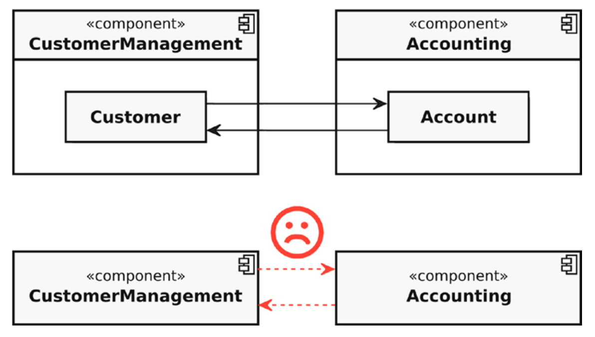
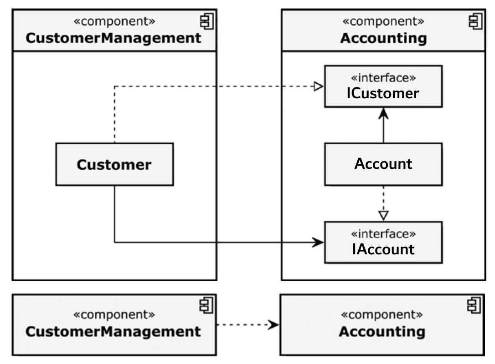
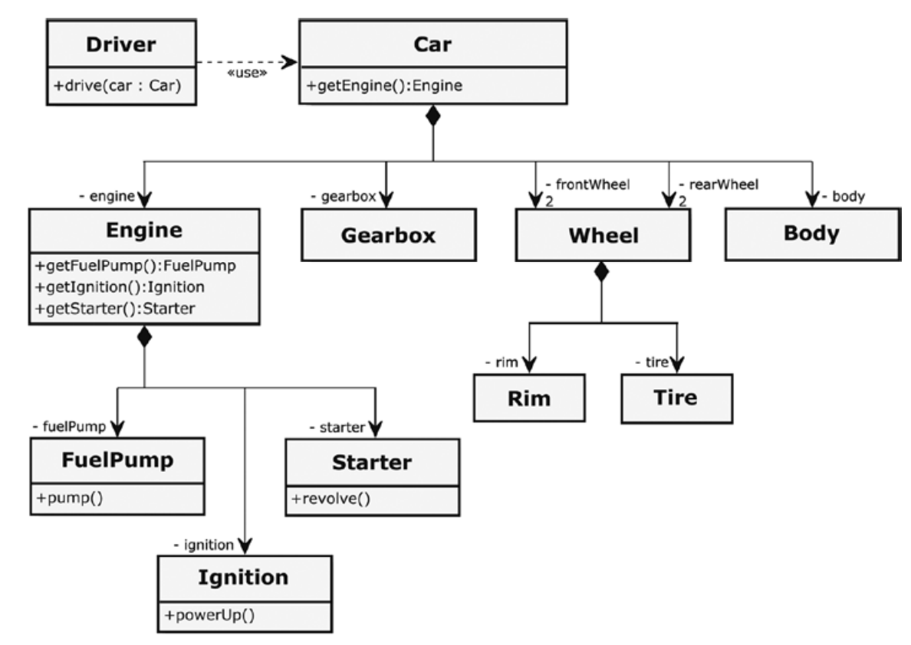

# 面向对象程序设计原则

Roth在第六章第三节介绍了一些可以帮助开发者设计出更好的类的原则。

## SOLID

### 单一责任（SRP）

Single Responsibility Principle (SRP)，该原则指出，每个软件单元（组件、类和函数）应该只有一个单一的、定义明确的责任。SRP基于前面提到过的强凝聚性原则——如果一个类有一个（定义明确的）职责，通常它的内聚力也会很强。

怎样算是遵守了SRP呢？在很多文献中的解释是，必须只有一个理由来改变这个类。当类由于系统不同方面的新需求或变化需要被改变时，这个类就违反了SRP。遵循SRP的类通常是小的，并且有很少的依赖性。它们是清晰的，易于理解，并且可以很容易地进行测试。

单一责任是一个比类的代码行数（LOC）好得多的标准。可以有100行、200行、甚至500行的类，如果这些类不违反单一责任原则，那就完全没问题。尽管如此，高的LOC数仍然可以是一个指标。它是一条线索，说明："你应该看看这些类！也许一切都很好，但也许它们如此之大正是因为它们有太多的责任。"

### 开闭原则（OCP）

Open-Closed Principle (OCP)，该原则指出，软件实体（模块、类、函数等）应该对扩展开放，但对修改封闭。一个简单的事实是，软件系统会随着时间的推移而不断发展。不断有新的需求必须得到满足，现有的需求也必须根据客户的需求或技术的进步而改变。这些扩展要以优雅的方式和尽可能少的努力来完成，而且要使现有的代码不需要被改变。如果任何新的需求都会导致对软件中现有的、经过良好测试的部分进行一连串的修改和调整，那将是致命的。

在面向对象中支持这一原则的方法之一是继承的概念。有了继承，就有可能在不修改一个类的情况下为其增加新的功能。一个典型例子就是前文松耦合原则处提到的Switch的例子：解耦合之后，这个设计是封闭的，不允许修改，但对扩展却很开放。我们可以很容易地添加更多的可开关设备，而不需要接触Switch、Lamp和接口Switchable类。

### 里氏替换（LSP）

> Basically the Liskov Substitution Principle states that you cannot create an octopus by  extending a dog with four additional fake legs.

Liskov Substitution Principle (LSP)，对该原则的描述是这样的：使用指向基类的指针或引用的函数必须能够使用派生类的对象而不知道它。我们用一个例子来解释它。

考虑一个Shape的虚基类，用它派生了Rectangle类，其中有私有成员width和height以及公有的修改接口setWidth(double a)、setHeight(double b)、setEdges(double a, double b)。现在我们计划将Square的概念引进这个系统，应该怎么做呢？

最直接的想法是从Rectangle派生出Square，限制width=height，增加公有修改接口setEdge(double a)。乍看很好，而且“Square **IS A** Rectangle”。但是这个设计存在严重的问题：

```C++
Square square;
square.setHeight(10); // Err...changing only the height of a square?!
square.setEdges(10, 20); // Uh oh!
```

显然，从Rectangle类继承下来的方法会给用户带来困惑，这违反了最小惊奇原则PLA。

```C++
std::unique_ptr<Rectangle> rectangle = std::make_unique<Square>();
// ...and somewhere else in the code...
rectangle->setEdges(10, 20);
```

这里定义了一个指向基类Rectangle的指针，使用派生类Square。根据里氏替换原则，该指针的函数setEdges(double a, double b)应该可以使用派生类对象而不知道它，而这里也正在尝试这么做（函数不知道这是Square，因为a=b的约束不满足）。但是显然，这种调用会使它不再是Square，不仅再次违反了PLA，而且破坏了Square类的不变式（接下来会讲到），这些都是很糟糕的错误。

这个例子说明，我们通常判断类之间的继承关系是否合理的“IS A”方法其实是有误导性的。在数学中，也许可以说正方形是一种特殊的矩形，但在编程中却不是这样！必须从另一个角度看待这个问题。

从纯数学的角度来看，一个正方形可以被看作是一个边长相等的矩形。但是这个定义不能直接转入面向对象的类型层次。**正方形不是矩形的一个子类型！**相反，具有正方形的形状只是矩形的一种特殊状态：如果一个矩形有相同的边长，这仅仅是矩形的一种性质，我们通常会在自然语言中称这种特殊的矩形为正方形。

因此，我们只需要给我们的矩形类添加一个isSquare()方法，而放弃声明一个派生类Square。我们用简单直接的代码实现了上面的思路，则根据KISS原则，这个方案可能完全可以满足新的要求。此外，可以提供一个方便的setter方法，用于平等地设置两条边的长度。

```C++
class Rectangle : public Shape {
public:
    // ...
    void setEdgesToEqualLength(const unsigned int newLength) {
        setEdges(newLength, newLength);
    }
    bool isSquare() const {
        return width == height;
    }
    //...
};
// So we can code like this
std::unique_ptr<Rectangle> rectangle = std::make_unique<Rectangle>();
if(rectangle->isSquare()){
    rectangle->setEdgesToEqualLength(20);
}
else{
    rectangle->setEdges(10,20);
}
```

在这个例子中，我们用里氏替换原则检查从Rectangle到Square的派生关系是否真正合理。如果不合理，就需要考虑放弃派生关系，考虑其他的实现方式。为了更细致地说明里氏替换的具体要求，下面介绍几个术语。

1. 前置条件：在方法运行前必须为真的条件。除非满足前置条件，否则不能保证方法会按应有的方式执行。
2. 后置条件：在方法运行后能够保证为真的条件。如果前置条件满足且方法实现无误，则可保证后置条件为真。
3. 不变式：总为真的条件。在方法调用前和调用后，不变式必定为真。（对于Square，就是长宽永远相等）

如果基类和派生类满足里氏替换，则**派生类必须可以完全替代它们的基类**。显然，Square类型的实例不能替换Rectangle。原因是width = height的约束（类不变式），它将被Square执行，但不能被Rectangle满足。

具体而言，里氏替换原则对类型和类的层次结构施加了如下要求：

- 基类方法的前置条件不能在派生子类中被加强。

- 基类方法的后置条件不能在派生子类中被弱化。
  
- 基类的所有不变式不能通过派生子类被改变或违反。

- 历史约束。一个对象的（内部）状态只能通过其公共接口的方法调用来改变（封装）。

由于派生类可能引入基类中不存在的新属性和方法，这些方法的引入可能允许派生类的对象发生基类中不允许的状态变化。所谓的"历史约束"禁止了这种情况。例如，如果基类被设计成不可变对象的蓝图，派生类就不应该在新引入的成员函数的帮助下使这种不可变的属性失效。

对于功能的重用，面向对象编程基本上有两种选择：继承（"白盒重用"）和组合/委托（"黑盒重用"）。而包括上面这个例子在内的很多实践都说明，有时通过组合/委托的重用比通过继承的重用更能促进类之间的松耦合，即只通过它定义好的公共接口（方法）来使用新的功能，而不是从这个类型派生出一个新的子类型。

### 接口隔离（ISP）

Interface Segregation Principle (ISP)，该原则指出，一个接口不应该过于臃肿，即包含实现类不需要的成员函数，或者包含实现类无法以有意义的方式实现的成员函数。来看一个例子。

```C++
class Bird {
public:
    virtual ~Bird() = default;
    virtual void fly() = 0;
    virtual void eat() = 0;
    virtual void run() = 0;
    virtual void tweet() = 0;
};
// This is OK for Sparrow
class Sparrow : public Bird {
public:
    virtual void fly() override {
        //...
    }
    virtual void eat() override {
        //...
    }
    virtual void run() override {
        //...
    }
    virtual void tweet() override {
        //...
    }
};
// But not OK for Penguin
class Penguin : public Bird {
public:
    virtual void fly() override {
        // ???
    }
    //...
};
```

这个例子中的接口是Bird类，包含fly()、eat()、run()、tweet()。这些方法都可以正确被Sparrow实现，然而，Penguin并不会飞，所以无法为Bird::fly()提供有意义的实现，但作为Bird接口的实现，Penguin被迫覆盖了这个成员函数。这时，我们就可以说Bird接口过于臃肿，因为包含实现类无法以有意义的方式实现的成员函数。ISP告诉我们，这时应该将这样臃肿的接口隔离成更小的、强凝聚的接口（称为“角色接口”），从而解决Penguin的问题：

```C++
class Lifeform {
public:
    virtual void eat() = 0;
    virtual void move() = 0;
};
class Flyable {
public:
    virtual void fly() = 0;
};
class Audible {
public:
    virtual void makeSound() = 0;
};

// These small role interfaces can now be combined very flexibly.
class Sparrow : public Lifeform, public Flyable, public Audible {
    //...
};
class Penguin : public Lifeform, public Audible {
    //...
};
```

### 依赖反转（DIP）

考虑这样一个例子：每一个顾客Custmer有自己的账号Account，顾客需要知道自己的账号，账号也需要知道自己的主人是谁。试用OOP建立这样的关系。一个自然的想法如下：

```C++
// in Customer.h
#include "Account.h"
class Customer {
// ...
private:
    Account customerAccount;
};

// in Account.h
#include "Customer.h"
class Account {
private:
    Customer owner;
};
```

显然，这样的实现会引发编译错误，因为会引发连锁反应：Account拥有Customer的一个实例，而Customer拥有Account的一个实例，后者拥有Customer的一个实例......当然，通过使用引用或指针与前向声明的结合可以避免编译错误：（此时Account是“不完全的类型”，只能用于指针或引用，但不能用于实例成员变量）

```C++
// in Custmer.h
class Account;
class Customer {
public:
    // ...
    void setAccount(Account* account) {
        customerAccount = account;
    }
    // ...
private:
    Account* customerAccount;
};
```

然而，这个实现仍然让人感到不适：如果Account的实例被删除而Customer实例仍然存在，则后者中的指针就会变成悬空的指针，使用这样的指针及其危险，可能导致未定义的行为或应用程序崩溃。虽然前向声明在某些场景下很有用，但在这里它只是一种用来掩盖设计上的严重缺陷的令人毛骨悚然的变通方法。这个设计缺陷就是Account和Custmer间的循环依赖关系本身。循环依赖关系使两者紧紧耦合在一起，无法分开，更别提独立使用和独立测试了。于是，我们有非循环依赖原则（Acyclic Dependency Principle），它告诫我们类或者组件之间的依赖关系**不应该成环**。循环依赖必须不惜一切代价进行铲除。依赖反转原则告诉了我们如何避免/解决这一问题。

Dependency Inversion Principle (DIP)，该原则指出，面向对象设计的基础不是具体软件模块的特殊属性。相反，它们的共同特征应该被整合到一个共享的使用的抽象概念中（例如，一个接口）。具体而言：

- 高等模块（用于调用方法）不应当依赖于低等模块（用于执行方法），而是两者都依赖于抽象（如接口）。
- 抽象不应该依赖于细节，而是细节应该依赖于抽象。

- **如果类A依赖于另一个类B，则应改为A依赖于接口IB，B变为接口IB的实现。**

根据这一原则的指导，我们将上面的例子进行设计优化。

```C++
// in ICustomer.h
#include <memory>
#include <string>
// interface for Customer to implement
class ICustomer {
public:
    virtual ~ICustomer() = default;
    virtual std::string getName() const = 0;
};
using ICustomerPtr = std::shared_ptr<ICustomer>;

// in IAccount.h
#include <memory>
#include <string>
// interface for Account to implement
class IAccount {
public:
    virtual ~IAccount() = default;
    virtual std::string getId() const = 0;
};
using IAccountPtr = std::shared_ptr<IAccount>;

// in Customer.h
#include "ICustomer.h"
#include "IAccount.h"
class Customer : public ICustomer {
public:
    void setAccount(IAccountPtr account) {
        customerAccount = account;
    }
    virtual std::string getName() const override {
        // return the Customer's name here...
    }
    // ...
private:
    IAccountPtr customerAccount;
    // ...
};
using CustomerPtr = std::shared_ptr<Customer>;

// in Account.h
#include "ICustomer.h"
#include "IAccount.h"
class Account : public IAccount {
public:
    void setCustomer(ICustomerPtr customer) {
        owner = customer;
    }
    virtual std::string getId() const override {
        // return the Account's Id here...
    }
    // ...
private:
    ICustomerPtr owner;
    // ...
};
using AccountPtr = std::shared_ptr<Account>;
```

现在，Customer原本依赖Account，改为依赖IAccount接口，Account实现该接口；Account依赖Customer同理。于是原本两者需要相互依赖的问题得以解决，而且优雅地遵守了IH原则。

如果将这套概念封装进两个组件CustomerManagement和Accounting中，违反DIP（左）和遵守DIP（右）的设计看上去分别是这样的：

<figure class="DIP">
    
    
</figure>


可以看到，循环依赖不仅发生在两个类之间，而且传播到了更高层的模块（组件）之间。而遵循DIP的设计从根本解决了这个问题，而且允许开发人员对组件间的依赖关系进行更灵活的设计——如果你想颠倒依赖关系，让Accounting依赖CustomerManagement，只需把两个接口移到CustomerManagement中即可。

最后一个问题：DIP的“反”体现在哪里呢？事实上依赖反转并不是真的“反”，只是相对于人类的直觉是“反”的——人类直觉上认为“我需要什么就要了解它的全貌”，而这恰好与IH冲突。OOP讲究依赖接口而非实现，“反”的依赖才是OOP中的“正”道。

## Law of Demeter

考虑一个复杂的系统——车，并有司机作为调用者。一辆车由几个部分组成，例如车身、发动机、齿轮等等。而这些部分由更小的组件组成，这些组件由更小的零件组成......这样就形成了这辆车自上而下的层级结构。我们按照这个思路进行系统的实现：



这个设计很好地遵守了单一责任原则，每个类都有明确定义的责任。现在让我们看一下司机类：

```C++
class Driver {
public:
    // ...
    void drive(Car& car) const {
        Engine& engine = car.getEngine();
        FuelPump& fuelPump = engine.getFuelPump();
        fuelPump.pump();
        Ignition& ignition = engine.getIgnition();
        ignition.powerUp();
        Starter& starter = engine.getStarter();
        starter.revolve();
    }
    // ...
};
```

为了开这辆车，司机必须亲自接触引擎，打开燃油泵，开启点火系统，再用启动器发动，你能想象这样的事吗？司机的责任只有开车，这并不需要了解车的详细架构和各个零件的使用方式。首先，将汽车和发动机的内部结构暴露给环境的公共getter都违反了IH，其次，假设汽车更新换代变成了电动车，其内部结构发生了变化，导致司机类的实现也必须重写，这违反了OCP。

本质上，这个设计违反了Law of Demeter (LoD)。这个原则可以被理解为类似于 "不要和陌生人说话"，或者 "只和你直接的邻居说话 "的原则。

LoD规定了以下规则：
- 一个成员函数被允许直接调用它自己类范围内的其他成员函数。
- 一个成员函数被允许直接调用它自己类范围内的成员变量上的成员函数。
- 如果一个成员函数有参数，允许该成员函数直接调用这些参数的成员函数。
- 如果一个成员函数创建了局部对象，则允许该成员函数在这些局部对象上调用成员函数。

如果上述四种成员函数调用中的一种返回一个在层次结构上比类的直接邻居更远的对象，则禁止在这些对象上调用成员函数。

现在我们回到司机的例子，问问自己：司机到底需要干什么？答案显而易见：司机只需要启动车辆！

```C++
class Driver {
public:
    // ...
    void drive(Car& car) const {
        car.start();
    }
    // ...
};
```

与此同时，车应该只做发动引擎的工作：

```C++
class Car {
public:
    // ...
    void start() {
        engine.start();
    }
    // ...
private:
    Engine engine;
};
```

然后，引擎去做打开燃油泵，开启点火系统，发动启动器的工作：

```C++
class Engine {
public:
    // ...
    void start() {
        fuelPump.pump();
        ignition.powerUp();
        starter.revolve();
    }
    // ...
private:
    FuelPump fuelPump;
    Ignition ignition;
    Starter starter;
};

```

现在，通过严格遵循LoD，前面的问题得以解决，司机不再需要知道车的内部实现就能完成工作了。

在设计软件时遵循LoD可以大大减少依赖关系的数量。这将导致松耦合，并促进了IH和OCP。当然，与其他许多原则和规则一样，也可能有一些合理的例外情况，这种情况下开发者必须出于非常好的理由才能改变这一原则。

## 避免贫血类

贫血类（anemic classes）是指形如这样的类：

```C++
class Customer {
public:
    void setId(const unsigned int id);
    unsigned int getId() const;
    void setForename(const std::string& forename);
    std::string getForename() const;
    void setSurname(const std::string& surname);
    std::string getSurname() const;
    //...more setters/getters here...
private:
    unsigned int id;
    std::string forename;
    std::string surname;
    // ...more attributes here...
};
```

这样的类不包含任何实质性的逻辑（setters/getters并不够称为逻辑），设计出这样的类的开发者只是把对象作为装着一堆数据的袋子。这与面向对象毫不相干（更别提里面大量愚蠢的setters/getters严重违背了IH）——实际上，这样的类完全可以只用一个简单的C结构（即结构体struct）来实现。

贫血类应该不惜一切代价避免——在不违反LoD的前提下，将逻辑植入类中（这样的逻辑只对该类的属性进行操作或者只与该类的直接邻居协作）。

## 传令勿问

Tell, Don’t Ask! 该原则指出，不应该要求一个对象公布关于其内部状态的信息，也不应该在这个对象之外决定它要做什么（如果这个对象能够自行决定）。（当然，有时有必要从一个对象中获取信息，例如，这些信息需要显示在图形用户界面上）

根据这个原则，在前面车的例子中，关于引擎start()方法的实现，就应该是下面的第二种而非第一种：

```C++
// do not implement like this
class Engine {
public:
    // ...
    void start() {
        if (! fuelPump.isRunning()) {
            fuelPump.powerUp();
            if (fuelPump.getFuelPressure() < NORMAL_FUEL_PRESSURE) {
                fuelPump.setFuelPressure(NORMAL_FUEL_PRESSURE);
            }
        }
        if (! ignition.isPoweredUp()) {
            ignition.powerUp();
        }
        if (! starter.isRotating()) {
            starter.revolve();
        }
        if (engine.hasStarted()) {
            starter.openClutchToEngine();
            starter.stop();
        }
    }
    // ...
private:
    FuelPump fuelPump;
    Ignition ignition;
    Starter starter;
    static const unsigned int NORMAL_FUEL_PRESSURE { 120 };
};
```

```C++
class Engine {
public:
    // ...
    void start() {
        fuelPump.pump();
        ignition.powerUp();
        starter.revolve();
    }
    // ...
private:
    FuelPump fuelPump;
    Ignition ignition;
    Starter starter;
};
```

第一种实现从其部件中查询许多状态并作出相应的反应，而且由于引擎还检查燃油泵的燃油压力，它必须知道正常燃油压力的值。此外，由于引入了很多if分支，该实现的复杂度很高。

而第二种实现遵循了该原则，不要求FuelPump等类公布自己的状态（使用它们的getters），也不在它们之外决定它们的执行（使用它们的内部方法），促进了IH。

至于检查燃油泵的燃油压力的工作，应该留给FuelPump自己的方法pump()去做。这时，内部方法可以设为private：

```C++
class FuelPump {
public:
    // ...
    void pump() {
        if (! isRunning) {
            powerUp();
            setNormalFuelPressure();
        }
    }
    // ...
private:
    void powerUp() {
        //...
    }
    void setNormalFuelPressure() {
        if (pressure != NORMAL_FUEL_PRESSURE) {
            pressure = NORMAL_FUEL_PRESSURE;
        }
    }
    bool isRunning;
    unsigned int pressure;
    static const unsigned int NORMAL_FUEL_PRESSURE { 120 };
};
```

